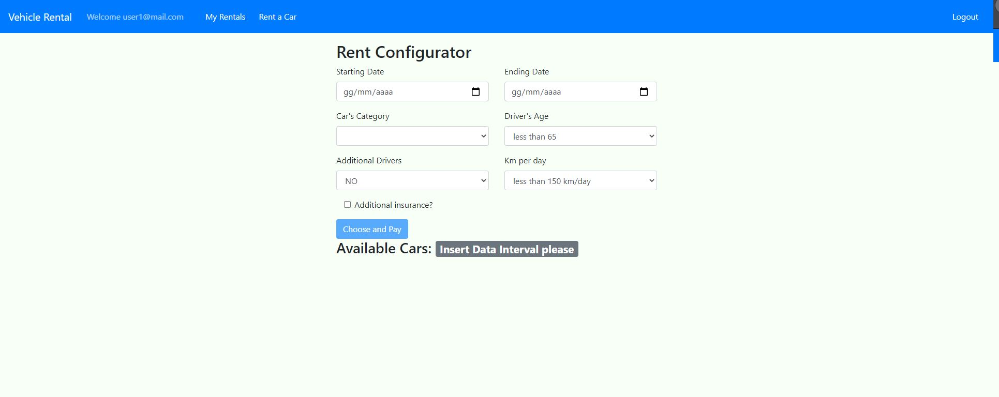

# Exam #1: "Noleggio Auto"
## Student: s280102 CAVALLO SIMONE

## React client application routes

- Route `/`: usata solo per reindirizzare l'utente in base allo stato del login
- Route `/cars`: pagina che mostra la sidebar con i vari filtri (marche e categorie) e la lista delle varie macchine presenti nel database.Vengono richiamate le    componenti Sidebar e CarList. 
- Route `/login`: pagina che contiene il form per l'autenticazione dell'utente. Richiama il componente LoginForm.
- Route `/rentals`: pagina che mostra i noleggi passati dell'utente loggato. Richiama il componente RentalsList.
- Route `/configurator`: pagina che mostra il configuratore per il noleggio. Richiama il componente Configurator.
- Route `/payment`: pagina che mostra il form per inserire i dati della carta per il pagamento e richiama il componente PaymentForm.

## REST API server

- POST `/api/login`
  - Parametri della richiesta : l'username e la password con cui effettuare la query
  - Parametri della risposta: user identificato in formato json
- POST `/api/logout`
  - Parametri della richiesta : nessuno
  - Parametri della risposta: nessuno
- GET `/api/cars`
  - Parametri della richiesta: nessuno
  - Parametri della risposta: lista delle auto nel db 
- GET `/api/brands`
  - Parametri della richiesta: nessuno
  - Parametri della risposta: lista dei brand nel db 
- GET `/api/categories`
  - Parametri della richiesta: nessuno
  - Parametri della risposta: lista delle categorie nel db 
- GET `/api/rentals/:id`
  - Parametri della richiesta: id dell'utente
  - Parametri della risposta: lista delle auto noleggiate dall'utente fornito
- DELETE `/api/delete`
  - Parametri della richiesta: n° di fattura del noleggio da elimanare
  - Parametri della risposta: nessuno
- POST `/api/rentals`
  - Parametri della richiesta : l'username e la password con cui dell'utente e i dati del noleggio sotto forma di oggetto noleggio
  - Parametri della risposta: nessuno
- POST `/api/available`
  - Parametri della richiesta : date di inizio e fine nolegio desiderato
  - Parametri della risposta: lista degli id delle auto disponibili nell'intervallo fornito
- POST `/api/stub`
  - Parametri della richiesta : oggetto che descrive una carta e costo del noleggio
  - Parametri della risposta: true o false

## Server database

- Table `USERS` - contiene id, name, passhash
- Table `CARS` - contiene id, model, brand, category, plate
- Table `RENTALS` - contiene CarID, UserID, cost, StartDate, EndDate, invoice

## Main React Components

- `NavBar` (in `/Components/NavBar.js`): componente che mostra la NavBar presente in tutte le pagine. Riceve come parametri lo stato del login (isLogged), l'user loggato (se lo è, authUser) e il metodo per il logout (logoutMethod). In base allo stato del login mostra bottoni differenti per effettuare il login in un caso oppure effettuare il logout e navigare nelle pagine nell'altro caso.
- `SideBar` (in `/Components/SideBar.js`): componente con lo scopo di mostrare la Sidebar contenente i vari filtri e attivarli (o disattivarli). Al componente vengono  passate le liste di brand e categorie (per essere mostrate), le liste di brand e categorie attivate come filtri e le funzioni per modificare queste ultime.
- `CarList` (in `/Components/CarList.js`): componente che ritorna lista delle auto in base ai filtri attivi nello stato. Al componente vengono passate la lista delle auto e le liste di filtri attivi (sia brand che categoria).
- `LoginForm` (in `/Components/LoginForm.js`): componente che viene richiamato e mostra il form per l'autenticazione. Sono passati gli stati che indicano un eventuale errore di login (authErr) e il valore booleano isLogged, oltre al metodo di login (loginMethod). In caso di errore il componente non prosegue e permette nuovi tentativi di login (ad intervalli di tempo) e in caso contrario rimanda l'utente loggato al configuratore.
- `RentalsList` (in `/Components/RentalsList.js`): componente che mostra la lista dei noleggi dell'utente loggato e li mostra in modo separato in base alla data (passati e futuri) e ne permette l'eliminazione . Vengono passate la lista delle auto e la lista dei noleggi personali dell'utente, entrambi contenuti nello stato (cars e rentals), e il metodo per eliminare un eventuale noleggio (deleteRent).
- `Configurator` (in `/Components/Configurator.js`): componente che mostra il configuratore del noleggio. Al componente vengono passati le liste di auto (cars),categorie (categories) e noleggi dell'utente (rentals) e l'id dell'user contenuti nello stato. Sono passati inoltre le funzioni per gestire gli errori (handleErrors) e per impostare il noleggio (setRent). Il configuratore mostra il numero di auto disponibili solo una volta inserito un intervallo di date e il prezzo solo dopo aver inserito anche la categoria.
- `PaymentForm` (in `/Components/PaymentForm.js`): componente che mostra il form per l'inserimento dei dati della carta. Al componenente vengono passati lo stato del login (isLogged), lo stato del pagamento (payState), il costo salvato nello stato (cost) e il metodo per il pagamento (pay). Se i dati dell acarta non sono corretti il componente non procede oltre, altrimenti rimanda alla pagina dei noleggi.

(only _main_ components, minor ones may be skipped)

## Screenshot

## Test users

* user1@mail.com, user1 (frequent customer)
* user2@mail.com, user2
* user3@mail.com, user3 
* user4@mail.com, user4
* user5@mail.com, user5 
